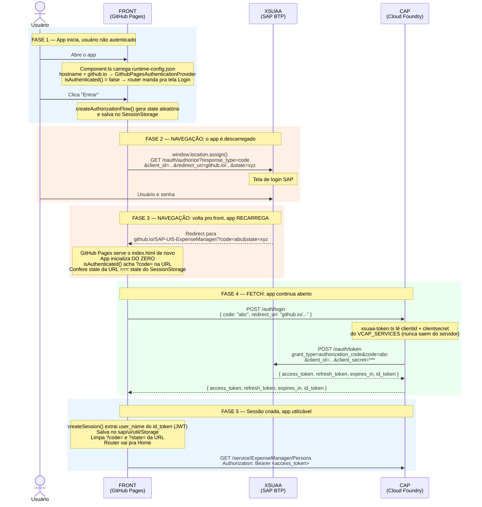

# Fluxo de Autenticação — ExpenseManager (GitHub Pages + XSUAA + CAP)

## O ponto que mais confunde

O fluxo tem **duas naturezas de chamada diferentes**, e misturar as duas é o que gera confusão:

| Tipo | O que acontece na tela | Quem participa |
|---|---|---|
| **Navegação do browser** | A página **sai do ar** e o app é descarregado. Depois volta e **reinicia do zero**. | Front ↔ XSUAA |
| **Chamada em background** (`fetch`) | A página **continua aberta**, nada pisca. | Front → CAP |

As idas ao XSUAA são navegações: o app morre e renasce.
A ida ao CAP é um `fetch`: o app continua vivo.

---

## O caminho completo, em ordem

```
1. FRONT          Usuário clica "Entrar"
       ↓          (navegação — o app é descarregado)
2. XSUAA          Tela de login SAP, usuário digita senha
       ↓          (navegação — volta pro GitHub Pages)
3. FRONT          App RECARREGA do zero, agora com ?code= na URL
       ↓          (fetch — app continua aberto)
4. CAP            POST /auth/login com o code
       ↓          (chamada servidor-a-servidor, invisível ao browser)
5. XSUAA          POST /oauth/token (CAP usa o clientsecret aqui)
       ↓
6. CAP            Recebe os tokens
       ↓          (resposta do fetch)
7. FRONT          Guarda a sessão e vai pra Home
```

Repare: **o front aparece duas vezes** (passos 1 e 3). Não é o mesmo "momento" do app — no passo 3 ele foi recarregado pelo browser e está começando tudo de novo, mas desta vez tem um `?code=` na URL pra processar.

---

## Diagrama de Sequência



---

## Por que cada parte é assim?

### Por que o app precisa sair do ar e ir pro XSUAA?

Porque a senha do usuário **só pode ser digitada no domínio da SAP**. Se o app pedisse a senha e repassasse, ele teria acesso à credencial — exatamente o que o OAuth existe pra evitar. O usuário digita a senha no XSUAA, e o app nunca vê.

### Por que volta pro GitHub Pages e o app recarrega do zero?

O `redirect_uri` que mandamos pro XSUAA é a URL do GitHub Pages. Quando o XSUAA termina o login, ele manda o browser pra lá. Como o GitHub Pages serve arquivos estáticos, o browser faz um GET novo no `index.html` e o UI5 inicializa como se fosse a primeira visita.

A diferença é que agora tem `?code=` na URL. O `isAuthenticated()` enxerga isso e entende: *"não é uma visita nova, é um retorno do login"*.

Por isso o `state` é salvo no `SessionStorage` antes de sair: é a única coisa que sobrevive ao recarregamento e permite confirmar que o retorno é legítimo.

### Por que vem um `code` e não o token direto?

O `code` é um ticket de uso único e vida curta (minutos). Se o XSUAA mandasse o token direto na URL, ele ficaria no histórico do browser e nos logs de qualquer proxy no caminho.

O `code` sozinho não vale nada: só vira token quando apresentado junto com o `clientsecret`.

### Por que o front não troca o `code` direto com o XSUAA?

Porque a troca exige o `clientsecret`, e ele **não pode ficar no browser** — qualquer pessoa abriria o DevTools e copiaria.

Então a troca é delegada ao CAP, que roda no servidor:

- O front manda o `code` pro CAP (`POST /auth/login`)
- O CAP, com o `clientsecret` vindo do `VCAP_SERVICES`, chama o XSUAA
- O CAP devolve só os tokens pro front

O `clientsecret` nunca cruza a rede em direção ao browser.

### Pra que serve o `state`?

Proteção contra **CSRF**. O app gera um valor aleatório, guarda no `SessionStorage` e manda junto na URL. O XSUAA devolve o mesmo valor. Se baterem, o retorno é legítimo.

Alguém que tentasse forjar um retorno com um `code` fabricado não teria como saber o `state` guardado na sessão do usuário real.

### O que é o `id_token`?

Um **JWT**: três partes em Base64 separadas por ponto (`header.payload.signature`). O `payload` traz os dados do usuário. O `XsuaaAuthHelper.extractUserName()` decodifica essa parte do meio e procura `user_name`, `name` ou `preferred_username`.

---

## Os 4 ambientes

| Ambiente | Provider | Como autentica |
|---|---|---|
| `github.io` | `GithubPagesAuthenticationProvider` | Este fluxo completo |
| `cfapps.*` (BTP) | `BtpAuthenticationProvider` | App router já resolveu antes do app carregar — o token chega pronto no header |
| `localhost` com `auth` na config | `GithubPagesAuthenticationProvider` | Mesmo fluxo, mas os endpoints viram relativos (`/auth/login`) e o `custom-proxy` encaminha pro BTP |
| `localhost` sem `auth` | `MockAuthenticationProvider` | Token falso, nenhuma chamada real |

---

## Arquivos envolvidos

| Arquivo | Papel |
|---|---|
| `webapp/auth/providers/XsuaaAuthHelper.ts` | Monta a URL do `/oauth/authorize`, faz o POST pro CAP, cria a sessão |
| `webapp/auth/providers/GithubPagesAuthenticationProvider.ts` | Dispara o redirect e detecta o `?code=` no retorno |
| `webapp/auth/storage/SessionStorage.ts` | Guarda sessão e `state` (sobrevive ao recarregamento) |
| `webapp/Component.ts` | Route guard: sem sessão vai pra Login, com sessão vai pra Home |
| `srv/auth/authRouter.ts` (CAP) | Expõe `POST /auth/login` e `POST /auth/refresh` |
| `srv/auth/xsuaa-token.ts` (CAP) | Lê o `clientsecret` do `VCAP_SERVICES` e chama o `/oauth/token` |
| `srv/middlewares/cors.ts` (CAP) | Libera o origin `https://davicastr.github.io` |
